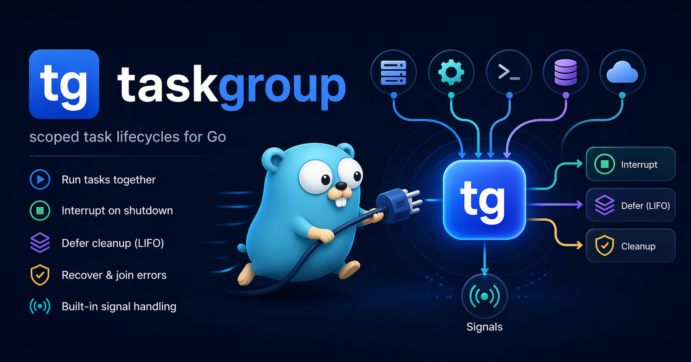

# `taskgroup`: scoped lifecycles for long-running Go tasks

[](https://github.com/gokern/taskgroup/actions/workflows/ci.yml)
[](https://github.com/gokern/taskgroup/actions/workflows/lint.yml)
[](https://github.com/gokern/taskgroup/actions/workflows/codeql.yml)
[](https://pkg.go.dev/github.com/gokern/taskgroup)
[](https://goreportcard.com/report/github.com/gokern/taskgroup)
[](go.mod)
[](https://github.com/gokern/taskgroup/releases)
[](LICENSE)

<p align="center">
  
</p>

Starting goroutines in Go is easy. Getting them to stop together, in order, with cleanup that actually runs? That's the part where `main.go` quietly goes from neat to tangled. `taskgroup` handles that lifecycle for you.

## Install

```sh
go get github.com/gokern/taskgroup
```

Requires Go 1.26+.

## Example

A typical `main.go` assembles services and runs them as one unit:

```go
func main() {
	ctx := context.Background()

	tasks := taskgroup.New()
	tasks.Add(taskgroup.SignalTask())
	tasks.Add(bootstrap.GRPCServerTask("api", apiGRPC, cfg.APIAddr()))
	tasks.Add(bootstrap.MetricsServerTask(cfg.Prometheus.Port))

	if err := tasks.Run(ctx); err != nil {
		log.Fatal(err)
	}
}
```

Every entry is a ready-made `taskgroup.Task` that knows how to start and stop itself, so `main.go` stays flat. A typical helper looks like this:

```go
func GRPCServerTask(name string, srv *grpc.Server, addr string) taskgroup.Task {
	return taskgroup.NewTask(func(context.Context) error {
		lis, err := net.Listen("tcp", addr)
		if err != nil {
			return err
		}
		return srv.Serve(lis)
	}).Interrupt(func(error) {
		srv.GracefulStop()
	})
}
```

When Ctrl-C or SIGTERM arrives, `SignalTask` returns, the group cancels its run context, and every registered interrupt fires. All tasks exit and `Run` returns their joined errors.

## API

Building tasks:

- `taskgroup.NewTask(fn).Interrupt(stop)` — a task with an explicit stop hook.
- `taskgroup.SignalTask(sigs...)` — a ready-made task that stops on shutdown signals.

Group lifecycle:

- `taskgroup.New()` — create a group.
- `tg.Add(task)` / `tg.AddFunc(fn)` — add a task.
- `tg.Defer(fn)` — cleanup after every task exits, LIFO like Go `defer`.
- `tg.Run(ctx)` — start the group; returns the first error.

Runnable examples are in `example_test.go`. Everything else is in the [godoc](https://pkg.go.dev/github.com/gokern/taskgroup).

## Signals

`SignalTask()` listens for `os.Interrupt` on Windows and `os.Interrupt + SIGTERM` on Unix. Pass your own to override:

```go
tg.Add(taskgroup.SignalTask(syscall.SIGHUP, syscall.SIGTERM))
```

Detect a signal shutdown with `IsSignalError`, extract the signal with `SignalFromError`.

## Errors

`Run` returns the first task error, the run context error, or nil if the first task finished cleanly. Errors from interrupts and defers are joined via `errors.Join`. Ordinary task errors that arrive after shutdown starts are dropped, so `http.ErrServerClosed` doesn't hide the real reason you stopped. Panics are recovered, wrapped with `ErrPanic`, and joined in.

## Scope

`taskgroup` is for application lifecycle: glue together servers, workers, signal handlers, and cleanup in one place. It's not a worker pool or a replacement for `errgroup` when you want to fan out a batch of jobs and collect their results.
