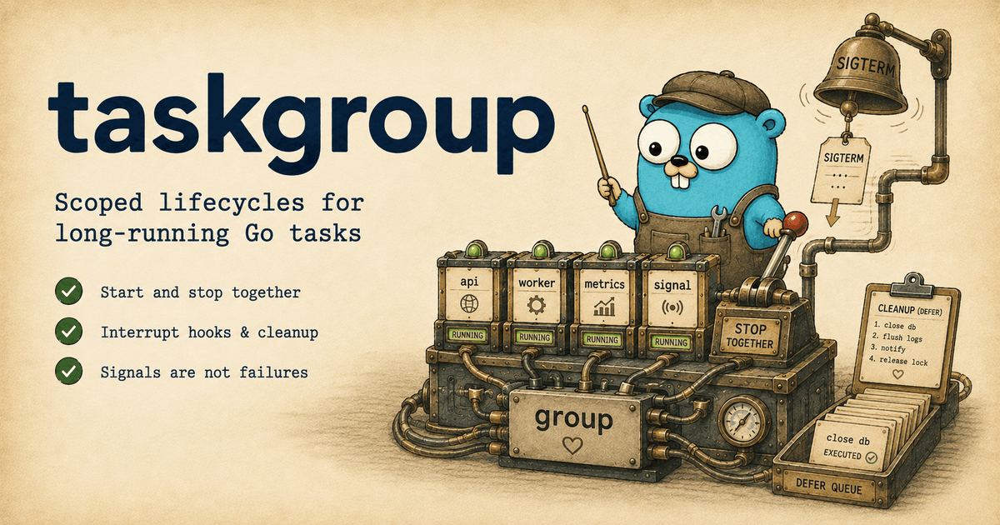

# `taskgroup`: scoped lifecycles for long-running Go tasks

[](https://github.com/gokern/taskgroup/actions/workflows/ci.yml)
[](https://github.com/gokern/taskgroup/actions/workflows/lint.yml)
[](https://github.com/gokern/taskgroup/actions/workflows/codeql.yml)
[](https://pkg.go.dev/github.com/gokern/taskgroup)
[](go.mod)
[](https://github.com/gokern/taskgroup/releases)
[](LICENSE)

<p align="center">
  
</p>

Starting goroutines in Go is easy. Getting them to stop together, in order, with cleanup that actually runs? That's the part where `main.go` quietly goes from neat to tangled. `taskgroup` handles that lifecycle for you.

## Install

```sh
go get github.com/gokern/taskgroup
```

Requires Go 1.26+.

## Example

A typical `main.go` assembles services and runs them as one unit:

```go
func main() {
	tasks := taskgroup.New()
	tasks.Add(taskgroup.SignalTask())
	tasks.Add(bootstrap.GRPCServerTask("api", apiGRPC, cfg.APIAddr()))
	tasks.Add(bootstrap.MetricsServerTask(cfg.Prometheus.Port))

	// A signal is how you asked it to stop, so it is not a failure.
	if err := tasks.Run(context.Background()); err != nil && !taskgroup.IsSignalError(err) {
		log.Fatal(err)
	}
}
```

Every entry is a ready-made `taskgroup.Task` that knows how to start and stop itself, so `main.go` stays flat. A typical helper looks like this:

```go
func GRPCServerTask(name string, srv *grpc.Server, addr string) taskgroup.Task {
	return taskgroup.NewTask(func(context.Context) error {
		lis, err := net.Listen("tcp", addr)
		if err != nil {
			return err
		}
		return srv.Serve(lis)
	}).Interrupt(func(error) {
		srv.GracefulStop()
	})
}
```

When Ctrl-C or SIGTERM arrives, `SignalTask` returns, the group cancels its run context, and every registered interrupt fires. All tasks exit, and the signal becomes the run's result: it is the first task to return, and the run context is still alive. `IsSignalError` is how you tell that apart from a real failure. Cancel the context instead of using `SignalTask` and a clean stop returns nil, with no sentinel to check.

## API

Building tasks:

- `taskgroup.NewTask(fn).Interrupt(stop)` — a task with an explicit stop hook.
- `taskgroup.SignalTask(sigs...)` — a ready-made task that stops on shutdown signals.

Group lifecycle:

- `taskgroup.New()` — create a group.
- `tg.Add(task)` / `tg.AddFunc(fn)` — add a task.
- `tg.Defer(fn)` — cleanup after every task exits, LIFO like Go `defer`.
- `tg.Run(ctx)` — start the group; returns the first error.

Runnable examples are in `example_test.go`. Everything else is in the [godoc](https://pkg.go.dev/github.com/gokern/taskgroup).

## Signals

`SignalTask()` listens for `os.Interrupt` on Windows and `os.Interrupt + SIGTERM` on Unix. Pass your own to override:

```go
tg.Add(taskgroup.SignalTask(syscall.SIGHUP, syscall.SIGTERM))
```

Detect a signal shutdown with `IsSignalError`, extract the signal with `SignalFromError`.

## Errors

Two values come out of a run. `Interrupt` and `Defer` functions get the cause: whatever stopped the group. `Run` hands you back the result, which is not always the same thing.

| How the run ended | Cause → `Interrupt` / `Defer` | `Run` returns |
| --- | --- | --- |
| a task returned `nil` first | `nil` | `nil` |
| a task returned an error first | that error | that error |
| a task panicked first | wrapped panic | wrapped panic |
| you canceled the run context | `context.Canceled` | `nil` |
| its deadline expired | `context.DeadlineExceeded` | `context.DeadlineExceeded` |
| a task returned a `Canceled` of its own, run context still alive | that error | that error |
| you canceled it with a reason | `context.Canceled` + your reason | your reason |
| its deadline expired with a reason | `context.DeadlineExceeded` + your reason | `context.DeadlineExceeded` + your reason |

A reason attached with `context.WithCancelCause` or `context.WithTimeoutCause` is joined with `ctx.Err()` before it reaches your cleanup code, so `errors.Is` finds either one there. `Run` returns that pair minus a bare cancellation: your reason on its own after a cancel, the pair intact after a deadline. The bare sentinel never travels with a reason, so `errors.Is(err, context.Canceled)` stays a reliable "this stopped cleanly" test.

Attaching an error means something went wrong, so a supervisor that tears the group down with `cancel(fmt.Errorf("config reload failed: %w", err))` gets that error back out of `Run` and the usual `log.Fatal` fires. If you want to stop without saying why, `cancel(nil)` sets the cause to `context.Canceled` and `Run` returns nil.

### Why a cancel is silent and a deadline isn't

`Run` swallows exactly one thing: a bare `context.Canceled`. You did that yourself and said nothing about why, so hearing about it tells you nothing you didn't already know. Manufacturing an error there would also race whatever a task was reporting, and leave every caller with a value to special-case.

A deadline is different. You set a budget, but nothing tells you whether it blew unless `Run` does:

```go
if err := tasks.Run(ctx); err != nil {
	if errors.Is(err, context.DeadlineExceeded) {
		log.Println("shutdown budget exceeded")
	}
	log.Fatal(err)
}
```

The suppression keys off the run's own context ending, not off what the error looks like. Hand back `context.Canceled` from a context of your own inside a task and it comes out like any other failure. That's the last row of the table.

Give the group a context that's already over and you get the same answer every run, however the internal race falls out. A cancel that lands while a task is already failing is a different matter: that failure goes the way of any other teardown error, as below.

### What tasks report on the way out

Once the group starts stopping, ordinary task errors are dropped. A task being torn down reports the stop you asked for, and there's no telling that apart from a real failure, so dropping them is what keeps `http.ErrServerClosed` from hiding your actual reason for stopping. The same goes the other way round: a task that failed on its own just before the context ended goes with the rest.

This is true when a task ended the run, not just when the context did. Once the first task to return has decided the run, a second task's error is coming from something already shutting down, so a run whose first task finished cleanly returns nil even if another task then failed. Look at the `main()` at the top of this README: `SignalTask` returns on Ctrl-C, and the servers behind it answer with whatever their own shutdown produces, `grpc.ErrServerStopped` or `http.ErrServerClosed`. Surfacing that second error would surface those too.

Panics never get dropped. They're recovered, wrapped so `errors.Is(err, ErrPanic)` holds, and joined onto the result via `errors.Join`. The wrapper is what makes something a panic here, not how the task ended, so an error that already carries `ErrPanic` survives shutdown and a nested group's panic stays visible in the group that ran it. Panics out of `Interrupt` functions and errors or panics out of `Defer` functions get joined on too. An `InterruptFunc` returns nothing, so a panic is all it can contribute.

One exception to the table: a group with no tasks has no cause and no result of its own, whatever the context did. Its `Defer` functions see a nil cause even past a deadline, and `Run` returns only what that cleanup contributes.

Whenever `Run` returns non-nil it returns a joined error, even when only one thing went wrong. Match it with `errors.Is` or `errors.As`; `==` will not find a task's error value, because `Run` never returns it directly.

`TestTaskGroup_Contract` in `taskgroup_test.go` pins every row above.

## Scope

`taskgroup` is for application lifecycle: glue together servers, workers, signal handlers, and cleanup in one place. It's not a worker pool or a replacement for `errgroup` when you want to fan out a batch of jobs and collect their results.
